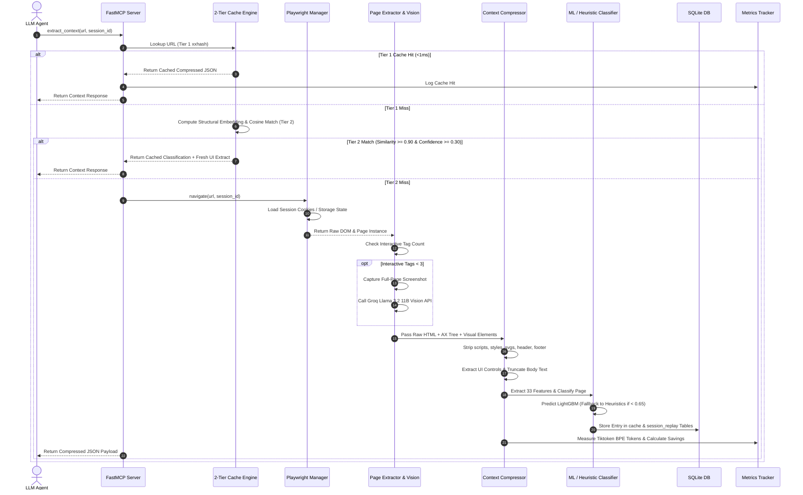

# System Architecture & Technical Design Specification
## Browser Optimizer MCP (v2)

> **Document Status**: Complete & Authoritative  
> **Target Audience**: Core Engineers, System Architects, & AI Integrators  
> **Related Document**: [PRD.md](file:///c:/Users/Manthan%20Railkar/Desktop/Git/Pidgey/PRD.md)

---

## 1. Executive Architecture Summary

The **Browser Optimizer MCP** is an intelligent middleware layer positioned between Large Language Model (LLM) agents and headless browsers (Playwright). Its primary goal is to **reduce LLM token consumption by 80% to 98%**, lower execution latency, and minimize API inference costs while providing high-precision context extraction, page classification, delta diffing, dynamic caching, and macro automation.

### Key Architectural Principles

1. **Meta-Tool Schema Optimization**: FastMCP tool listing override returning only meta-tools (`list_tools`, `get_tool_schema`) to reduce initial LLM handshake prompt size from ~15,000 tokens to ~300 tokens.
2. **Two-Tier Semantic Caching**:
   - **Tier 1**: 64-bit `xxhash` signature of raw HTML stored in persistent SQLite for sub-millisecond cache hits.
   - **Tier 2**: 68-dimensional structural DOM vector embedding with L2 normalization and cosine similarity matching ($\ge 0.90$) for template matching on dynamic pages.
   - **Dynamic Confidence Auto-Decay**: Confidence score ($0.0 - 1.0$) updated dynamically ($+0.05$ reward on action success, $-0.30$ penalty on action failure). Low-confidence entries ($< 0.30$) bypass cache lookup.
3. **Hybrid Extraction & Multimodal Perception (VLM)**: Automatic detection of canvas-heavy / SPA pages with $< 3$ interactive DOM elements, triggering multimodal vision analysis via Groq (Llama 3.2 11B Vision) combined with ARIA snapshots.
4. **Machine Learning & Heuristic Page Classification**: 33-feature DOM extraction feeding a multiclass LightGBM model to categorize pages into 12+ categories (`LOGIN`, `SEARCH`, `CHECKOUT`, `PRODUCT`, `SURVEY`, `DASHBOARD`, etc.) with fallback to rule-based heuristic scoring.
5. **State Difference Engine**: UI element fingerprinting returning incremental delta updates (`added`, `removed`) between consecutive observations.
6. **Macro Automation & Adaptive Replay**: Recording browser action sequences, parameterizing dynamic values, and replaying them with confidence scoring, post-state verification, and step suspension/resumption capabilities.
7. **Verifiable Observability**: Embedded HTTP server (`:8050`) serving real-time metrics, exact BPE LLM token counting (`tiktoken cl100k_base`), verifiable dollar savings, side-by-side verification reports (`/api/verify_comparison`), and session replay visualizers.

---

## 2. Comprehensive System Architecture Diagram

The diagram below illustrates the complete component topology, data flows, storage boundaries, and telemetry channels across the entire middleware stack.

```mermaid
flowchart TD
    subgraph ClientLayer ["1. Client & Interface Layer"]
        Agent["AI Agent / LLM Client\n(Claude, Antigravity, Cursor)"]
        StdIO["FastMCP Stdio Server\n(main.py)"]
        MetaTools["Meta-Tool Registry\n(list_tools / get_tool_schema)"]
    end

    subgraph CacheLayer ["2. Two-Tier Caching & Embedding Subsystem"]
        xxHash["Tier 1: 64-bit xxhash\nExact Match (<1ms)"]
        EmbedEngine["Tier 2: 68-D Structural DOM Embedding\n(Tag Hist, CSS Hash, Depth, Attributes)"]
        CosineMatch["Cosine Similarity Engine\n(Threshold >= 0.90)"]
        DecayLogic["Dynamic Confidence Engine\n(Reward +0.05 / Decay -0.30)"]
    end

    subgraph ExtractionLayer ["3. Extraction, Compression & Vision Subsystem"]
        PageExtractor["Page Extractor\n(extractor.py & BeautifulSoup)"]
        AXSnapshot["ARIA Tree Snapshot Engine\n(aria_snapshot)"]
        VisionFallback{"Interactive Tags < 3 ?"}
        GroqVLM["Multimodal Vision Analyzer\n(Groq Llama 3.2 11B Vision)"]
        Compressor["DOM Context Compressor\n(Decomposes scripts, styles, svgs)"]
    end

    subgraph IntelligenceLayer ["4. Intelligence & Classification Subsystem"]
        FeatExtractor["33-Feature Extractor\n(feature_extractor.py)"]
        LGBMModel["LightGBM ML Classifier\n(page_classifier.pkl >= 0.65)"]
        HeuristicEngine["Rule-Based Heuristic Fallback\n(LOGIN, SEARCH, CHECKOUT, etc.)"]
        DiffEngine["State Difference Engine\n(added / removed UI diffs)"]
    end

    subgraph ExecutionLayer ["5. Browser Execution & Automation Engine"]
        BrowserManager["Async Browser Manager\n(manager.py & Playwright)"]
        Chromium["Chromium Headless Instance"]
        RuleExecutor["Rule-Based Action Executor\n(click, fill, select, scroll)"]
        MacroEngine["Macro Automation & Skill Engine\n(record, parameterize, replay, resume)"]
    end

    subgraph StorageLayer ["6. Persistence Subsystem (SQLite)"]
        DB[("SQLite Database\n(cache.db)")]
        TableCache["cache Table"]
        TableMacros["macros Table"]
        TableSessions["session_states Table"]
        TableReplay["session_replay Log"]
    end

    subgraph TelemetryLayer ["7. Telemetry & Observability Subsystem"]
        TiktokenEngine["Tiktoken BPE Counter\n(cl100k_base Exact Tokens)"]
        MetricsTracker["Thread-Safe Metrics Tracker\n(metrics.py)"]
        DashboardServer["Dashboard HTTP Server\n(server.py :8050)"]
        WSServer["Live Page Watcher WebSocket\n(ws://localhost:8765)"]
    end

    %% Flow Connections
    Agent <-->|MCP stdio JSON-RPC| StdIO
    StdIO --- MetaTools
    StdIO -->|1. Request Context| xxHash

    xxHash -->|Cache Hit| Agent
    xxHash -->|Cache Miss| EmbedEngine
    EmbedEngine --> CosineMatch
    CosineMatch -->|Similarity >= 0.90| Agent
    CosineMatch -->|Cache Miss| BrowserManager

    BrowserManager --> Chromium
    Chromium --> PageExtractor
    PageExtractor --> AXSnapshot
    PageExtractor --> VisionFallback

    VisionFallback -->|Yes (Canvas/SPA)| GroqVLM
    VisionFallback -->|No (Standard HTML)| Compressor
    GroqVLM --> Compressor
    AXSnapshot --> Compressor

    Compressor --> FeatExtractor
    FeatExtractor --> LGBMModel
    LGBMModel -->|Confidence < 0.65| HeuristicEngine
    LGBMModel & HeuristicEngine --> DiffEngine

    DiffEngine -->|Update Cache| DB
    DB --- TableCache
    DB --- TableMacros
    DB --- TableSessions
    DB --- TableReplay

    BrowserManager <-->|Persist / Load Cookies & Storage| TableSessions
    RuleExecutor <--> MacroEngine
    MacroEngine <--> TableMacros

    Compressor --> TiktokenEngine
    TiktokenEngine --> MetricsTracker
    MetricsTracker --> DashboardServer
    DiffEngine --> WSServer
```

---

## 3. Sequential Context Extraction Data Flow

This sequence diagram details the runtime execution path for an `extract_context` tool call.



---

## 4. Macro Skill Lifecycle & Adaptive Resumption State Machine

This state machine describes how macro skills are recorded, parameterized, replayed with confidence rewards/penalties, suspended on failure, and resumed dynamically.

```mermaid
stateDiagram-v2
    [*] --> Idle: Initialize Session

    state "Recording State" as Recording {
        Idle --> Recording: start_macro_recording()
        Recording --> Recording: Record Playwright User Actions
        Recording --> Parameterize: save_macro(name, parameters_map)
        Parameterize --> Idle: Persist to SQLite `macros` table
    }

    state "Replay State" as Replay {
        Idle --> Replaying: replay_skill(macro_id, parameters)
        Replaying --> StepExecution: Inject Parameter Values
        StepExecution --> Verification: Perform Action & Verify Post-State
        
        state FailureDecision <<choice>>
        Verification --> FailureDecision: Check Outcome
        
        FailureDecision --> NextStep: Action Succeeded
        NextStep --> StepExecution: Next Step Exists
        NextStep --> ReplaySuccess: All Steps Completed
        
        ReplaySuccess --> DecayReward: Increase Confidence (+0.05)
        DecayReward --> Idle: Complete Execution

        FailureDecision --> ReplayFailed: Step Execution Failed / Mismatch
        ReplayFailed --> DecayPenalty: Decrease Confidence (-0.30)
        DecayPenalty --> Suspended: Save Failed Step Index & Current DOM State
    }

    state "Resumption State" as Resumption {
        Suspended --> Resuming: resume_skill(parameters, session_id)
        Resuming --> StepExecution: Resume from Failed Step + 1
    }
```

---

## 5. Subsystem Component Breakdown

### 5.1 Protocol & Interface Layer (`browser_optimizer/server/` & `cli.py`)
- **FastMCP Server**: Houses stdio JSON-RPC MCP server endpoints.
- **Meta-Tool Optimizer**: Overrides protocol handler to hide heavy tool schemas during initial handshake, serving schemas on-demand via `get_tool_schema`.

### 5.2 Two-Tier Caching Engine (`browser_optimizer/cache/`)
- **`cache.py`**: Coordinates Tier 1 (`xxhash.xxh64`) exact string hash matching and Tier 2 cosine similarity matching.
- **`embedding.py`**: Computes a 68-dimensional numerical feature vector:
  - 30-dim Tag Vocabulary Histogram
  - 32-dim Hash-bucketed CSS Class Fingerprints (`xxhash.xxh32(cls) % 32`)
  - 2-dim DOM Depth Statistics
  - 4-dim Attribute Pattern Counts (`id`, `name`, `type`, `placeholder`)
- **`db.py`**: SQLite data access layer handling `cache`, `macros`, `session_states`, and `session_replay` tables.

### 5.3 Extraction & Compression Pipeline (`browser_optimizer/extractor/` & `compressor/`)
- **`extractor.py`**: Extracts DOM HTML and ARIA accessibility trees. Triggers visual fallback if interactive tags $< 3$.
- **`vision.py`**: Integrates Groq Llama 3.2 11B Vision for canvas applications, SPAs, and visual elements.
- **`compressor.py`**: Decomposes non-essential nodes (`script`, `style`, `svg`, `header`, `footer`) and extracts clean interactive elements into structured JSON objects.

### 5.4 Page Classification & Feature Extraction (`browser_optimizer/classifier/`)
- **`feature_extractor.py`**: Derives 33 exact numerical features from DOM trees and text.
- **`predict.py`**: Loads serialized `page_classifier.pkl` (LightGBM) model to classify pages across 12 categories with confidence threshold $\ge 0.65$.
- **`classifier.py`**: Provides unified interface with automatic fallback to heuristic scoring rules.

### 5.5 Execution & Macro Engine (`browser_optimizer/browser/`, `executor/`, `diff/`)
- **`manager.py`**: Async Playwright wrapper managing browser context lifecycles and storage state restoration.
- **`executor.py`**: Executes Playwright DOM interactions (`click`, `fill`, `select`, `scroll`).
- **`diff.py`**: Fingerprints UI controls to compute `added` and `removed` element arrays.

### 5.6 Telemetry & Embedded Dashboard (`browser_optimizer/metrics/` & `dashboard/`)
- **`metrics.py`**: Thread-safe tracker measuring exact BPE LLM token counts via `tiktoken` (`cl100k_base`).
- **`server.py`**: Embedded HTTP daemon server (`:8050`) serving `/api/metrics`, `/api/verify_comparison`, and `/api/replay`.
- **`index.html`**: Glassmorphic dashboard UI for monitoring token savings, macro statistics, and session replay streams.

---

## 6. Verification & Auditing Endpoints

| Endpoint | Method | Response Payload / Description |
| :--- | :--- | :--- |
| `/` | `GET` | HTML Dashboard User Interface ([index.html](file:///c:/Users/Manthan%20Railkar/Desktop/Git/Pidgey/browser_optimizer/dashboard/index.html)) |
| `/api/metrics` | `GET` | Real-time JSON metrics (exact tokens saved, compression ratio, cache hits, dollar savings) |
| `/api/verify_comparison` | `GET` | Side-by-side verification payload comparing raw HTML token counts vs compressed JSON tokens |
| `/api/replay?session_id={id}` | `GET` | Array of session replay events and action histories |
