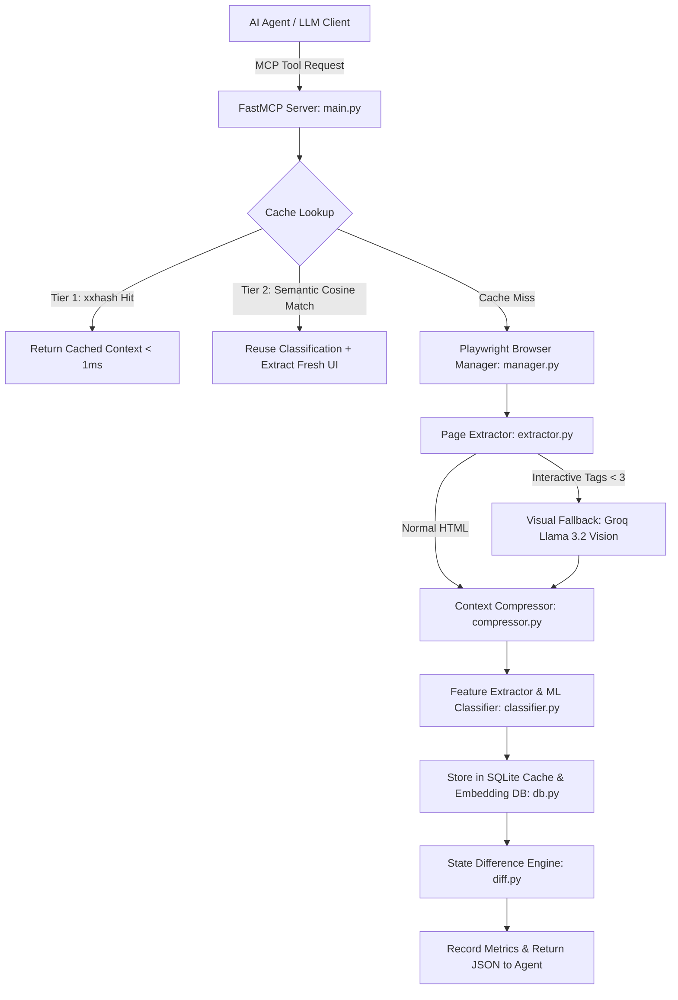

# Browser Optimizer MCP (v2) — Complete Step-by-Step Implementation Blueprint & PRD

> **Product Requirement Document (PRD) & Precise Architecture Specification**  
> _A modular, step-by-step guide to building a high-efficiency Browser Optimization Middleware for AI Agents using FastMCP, Playwright, LightGBM, and SQLite._

---

## 1. Executive Summary & System Architecture

### 1.1 Objective

The **Browser Optimizer MCP** is an intelligent middleware layer sitting between Large Language Model (LLM) agents and headless browsers (Playwright). Its primary goal is to **reduce LLM token consumption by 80% to 98%**, lower execution latency, and minimize API inference costs while providing high-precision context extraction, page classification, delta diffing, and macro automation.

### 1.2 Core Architectural Principles

1. **DOM Compression**: Decompose non-essential markup (`script`, `style`, `svg`, `footer`, `header`) and extract clean, structured interactive UI controls (`button`, `input`, `select`, `a`, `textarea`, `form`).
2. **Two-Tier Semantic Caching**:
   - **Tier 1**: 64-bit `xxhash` signature of raw HTML stored in persistent SQLite for sub-millisecond cache hits.
   - **Tier 2**: 68-dimensional structural DOM vector embedding with L2 normalization and cosine similarity matching ($\ge 0.90$) for template matching on pages with dynamic content.
3. **Machine Learning & Heuristic Classification**: 33-feature DOM extraction feeding a multiclass LightGBM model to categorize pages into 12+ categories (`LOGIN`, `SEARCH`, `CHECKOUT`, `PRODUCT`, `SURVEY`, `DASHBOARD`, etc.) with fallback to rule-based heuristic scoring.
4. **Visual Fallback & Multimodal Perception (VLM)**: Automatic detection of canvas-heavy / SPA pages with $< 3$ interactive DOM elements, triggering multimodal vision analysis via Groq (Llama 3.2 11B Vision). Combines text-based ARIA compression with cropped visual bounding boxes and feature embeddings for key UI components to resolve visual challenges such as CAPTCHAs, custom canvas controls, and dynamic charts.
5. **State Difference Engine**: UI element fingerprinting to return incremental delta updates (`added`, `removed`) between consecutive observations.
6. **Macro Automation & Adaptive Replay**: Recording browser action sequences, parameterizing values, and replaying them with confidence scoring, post-state verification, and suspension/resumption capabilities.
7. **Meta-Tool Schema Optimization**: FastMCP tool listing override returning only meta-tools (`list_tools`, `get_tool_schema`) to save thousands of context window tokens during initial LLM handshakes.
8. **Live Telemetry & Verifiable Token Dashboard**: Embedded HTTP server (`:8050`) serving real-time metrics, exact BPE LLM token counting (`tiktoken cl100k_base`), verifiable dollar savings, side-by-side verification reports (`/api/verify_comparison`), and session replay visualizers.

---

## 2. Component Pipeline Overview



---

## 3. Step-by-Step Implementation Blueprint

---

### Part 1: Project Initialization & Configuration Infrastructure

#### Step 1.1: Package Configuration (`pyproject.toml`)

Establish Python package metadata, entry points, and strict version constraints for core dependencies.

- **Dependencies**: `playwright>=1.40.0`, `mcp>=1.0.0`, `beautifulsoup4>=4.12.0`, `httpx>=0.25.0`, `loguru>=0.7.0`, `lxml>=4.9.0`, `pydantic>=2.0.0`, `pydantic-settings>=2.0.0`, `python-dotenv>=1.0.0`, `xxhash>=3.0.0`, `cachetools>=5.0.0`, `websockets>=12.0`.
- **CLI Script**: Register `browser-optimizer = "browser_optimizer.cli:main"`.

#### Step 1.2: Environment Settings (`browser_optimizer/config/settings.py`)

Create a centralized `Settings` class loading environment variables with fallback defaults:

- `LOG_LEVEL` (default `"INFO"`)
- `HEADLESS` (default `True`)
- `CACHE_ENABLED` (default `True`), `CACHE_TTL` (default `300`s), `CACHE_MAX_SIZE` (default `100`)
- `BROWSER_TIMEOUT` (default `30000`ms)
- `SIMILARITY_THRESHOLD` (default `0.9`), `CLASSIFICATION_THRESHOLD` (default `0.65`)
- `WEBSOCKET_HOST` (`"localhost"`), `WEBSOCKET_PORT` (`8765`), `DASHBOARD_PORT` (`8050`)
- `VISUAL_FALLBACK_THRESHOLD` (default `3`)
- `GROQ_API_KEY`, `GROQ_VISION_MODEL` (`"llama-3.2-11b-vision-preview"`)

#### Step 1.3: Data Schemas (`browser_optimizer/schemas/schemas.py`)

Define Pydantic data models for API boundaries:

- `UIElement`: `tag`, `text`, `id`, `name`, `placeholder`, `type`, `href`.
- `CompressedContext`: `ui` (List[UIElement]), `ax_tree`, `url`, `title`, `text_content`, `raw_html_length`, `compressed_length`, `compression_ratio`.
- `ClassificationResult`: `page_type`, `scores` (Dict[str, float]).
- `PageDiff`: `url`, `added`, `removed`, `changed`.
- `ActionRequest` & `ActionResult`.

#### Step 1.4: Logging Utility (`browser_optimizer/utils/logger.py`)

Configure `loguru` to format logs cleanly to `sys.stderr` to keep standard output (`sys.stdout`) completely unpolluted for MCP `stdio` communication.

---

### Part 2: Browser Management & Persistent Session State

#### Step 2.1: SQLite Session State Store (`browser_optimizer/cache/db.py`)

Implement `SessionStateStore` in SQLite (`session_states` table) to persist and restore Playwright browser context states (`cookies`, `localStorage`, `sessionStorage` JSON blobs) across restarts.

#### Step 2.2: Async Browser Manager (`browser_optimizer/browser/manager.py`)

Implement `BrowserManager`:

- Initialize single `Playwright` driver and launch `chromium` browser instance.
- Maintain `self.sessions: Dict[str, Tuple[BrowserContext, Page]]` keyed by `session_id`.
- `get_page(session_id)`: Loads existing session or creates a new `BrowserContext` with restored storage state from SQLite.
- `navigate(url, session_id)`: Navigates page with timeout, waits for `"domcontentloaded"`, and automatically invokes `save_session_state(session_id)`.
- `close_session(session_id)` & `stop()`: Cleanly close contexts and shut down browser processes.

---

### Part 3: Extraction Engine, Visual Fallback & Context Compression

#### Step 3.1: Visual Fallback & Multimodal Perception Module (`browser_optimizer/extractor/vision.py`)

Implement `VisionAnalyzer`:

- Captures full-page JPEG screenshot as base64 string via Playwright.
- Queries Groq Chat Completions API with multimodal image payload using `llama-3.2-11b-vision-preview`.
- **Multimodal Perception (VLM Integration)**: Combines text-based ARIA tree compression with cropped visual bounding boxes and feature embeddings for key UI components. Passing visual feature embeddings alongside compressed DOM elements enables neural networks to solve visual challenges like CAPTCHAs, custom canvas controls, and dynamic charts.
- Parses JSON array of identified UI controls (`tag`, `text`, `id`, `type`).
- Graceful fallback: If API key is missing or fails, generates synthetic canvas interactive element descriptors (`visual_canvas_main`, `visual_input_main`).

#### Step 3.2: Page Extractor (`browser_optimizer/extractor/extractor.py`)

Implement `PageExtractor`:

- `extract_html(page)`: Retrieves raw HTML string.
- `parse_html(html)`: Parses DOM with `BeautifulSoup(html, "lxml")`.
- `extract_ax_tree(page)`: Calls `page.locator("body").aria_snapshot()` to generate a semantic ARIA snapshot tree.
- Checks count of interactive elements (`button`, `input`, `textarea`, `select`, `label`, `form`, `a`). If $< 3$ (threshold), triggers `VisionAnalyzer.capture_and_analyze()`.

#### Step 3.3: Context Compressor (`browser_optimizer/compressor/compressor.py`)

Implement `ContextCompressor`:

- `clean_dom(soup)`: Decomposes non-essential elements: `{"script", "style", "footer", "header", "noscript", "svg", "iframe"}`.
- `remove_empty(soup)`: Recursively decomposes tags with no text and no children.
- `extract_ui(soup)`: Extracts interactive tags into structured dictionary representations. Merges visual elements if present.
- Extracts clean body text capped at 2,000 characters.
- Calculates exact compression ratio: `round((1 - compressed_length / raw_html_length) * 100, 1)`.

---

### Part 4: Persistent SQLite Cache, Structural Embeddings & 2-Tier Caching

#### Step 4.1: Structural DOM Embeddings (`browser_optimizer/cache/embedding.py`)

Implement `StructuralEmbedding` to produce a 68-dimensional numerical feature vector ignoring raw text:

1. **Tag Vocabulary Histogram (30 dimensions)**: Normalized frequency of 30 common tags (`div`, `span`, `p`, `a`, `button`, `input`, `form`, etc.).
2. **CSS Class Fingerprints (32 dimensions)**: Hash-bucketed CSS class name distribution using `xxhash.xxh32(cls) % 32`.
3. **DOM Depth Statistics (2 dimensions)**: Normalized max DOM depth and mean DOM depth.
4. **Attribute Pattern Counts (4 dimensions)**: Normalized counts of elements containing `id`, `name`, `type`, or `placeholder`.
5. **L2 Normalization & Cosine Similarity**: Normalizes vector to unit length so dot product equals cosine similarity.

#### Step 4.2: SQLite Storage Engine (`browser_optimizer/cache/db.py`)

Build SQLite backend tables in `cache.db`:

- `cache`: `key` (URL), `value` (JSON), `created_at`, `ttl`, `hit_count`, `embedding` (JSON string), `confidence` (float).
- `macros`: `id`, `name`, `page_type`, `sequence` (JSON), `confidence`, `success_count`, `fail_count`.
- `session_replay`: Append-only event log (`session_id`, `timestamp`, `page_classification`, `action_taken`, `confidence_used`, `outcome`).

#### Step 4.3: Two-Tier Semantic Cache (`browser_optimizer/cache/cache.py`)

Implement `SemanticCache`:

- **Tier 1 (Exact Hash Match)**: Generates 64-bit `xxhash.xxh64` signature of HTML. Returns cached context in $< 1\text{ms}$ if hash matches.
- **Tier 2 (Semantic Similarity Match)**: If exact match misses, computes 68-dim `StructuralEmbedding` and computes cosine similarity against all cached page embeddings. If max similarity $\ge 0.90$, returns cached context tagged with `semantic_match=True`.
- **Dynamic Confidence Auto-Decay**: Each entry tracks confidence score ($0.0 - 1.0$). Successful interactions increase confidence ($+0.05$), failures decay confidence ($-0.30$). If confidence $< 0.30$, cache lookup skips reuse; if $0.30 \le \text{confidence} < 0.70$, title verification is enforced.

---

### Part 5: Feature Extractor, ML Page Classifier & Heuristic Engine

#### Step 5.1: 33-Feature Extractor (`browser_optimizer/classifier/feature_extractor.py`)

Implement `FeatureExtractor` extracting 33 exact numerical features from page context:

- Tag counts (`input_count`, `button_count`, `link_count`, `form_count`, `image_count`, `heading_count`, `list_count`, `table_count`).
- Input types (`password_fields`, `email_inputs`, `checkbox_count`, `radio_count`).
- UI Indicators (`search_box_present`, `navbar_present`, `footer_present`, `sidebar_present`, `modal_present`).
- ARIA statistics (`aria_labels_count`, `aria_buttons_count`, `aria_roles_count`).
- Keyword frequencies (`login`, `register`, `search`, `cart`, `checkout`, `payment`, `profile`, `add_to_cart`).
- Form dimensions (`avg_form_size`, `max_form_size`, `submit_button_count`).
- Metadata lengths (`title_length`, `visible_text_length`).

#### Step 5.2: LightGBM Inference Engine (`browser_optimizer/classifier/predict.py`)

Implement `PageClassifierPredictor`:

- Loads serialized model artifacts: `page_classifier.pkl` (LightGBM model), `label_encoder.pkl`, `feature_names.pkl`.
- Predicts page category probabilities across classes (`login`, `search`, `product`, `checkout`, `survey`, `dashboard`, etc.).
- Enforces classification confidence threshold ($\ge 0.65$). If confidence is below threshold, returns `"unknown"`.

#### Step 5.3: Unified Classifier (`browser_optimizer/classifier/classifier.py`)

Implement `TaskClassifier`:

- Attempts ML prediction via `PageClassifierPredictor`.
- If ML predictor returns `"unknown"` or throws an error, executes a rule-based heuristic scoring engine evaluating element text, placeholders, and types for 6 core categories (`LOGIN`, `SEARCH`, `CHECKOUT`, `PRODUCT`, `SURVEY`, `DASHBOARD`).

#### Step 5.4: Classifier Training Pipeline (`training/train.py`)

Implement standalone training script:

- Reads dataset `data/page_dataset.csv`.
- Encodes target categories with `LabelEncoder`.
- Performs 80/20 stratified train-test split.
- Fits `lgb.LGBMClassifier(objective="multiclass", num_class=12, n_estimators=300, max_depth=8)`.
- Evaluates test accuracy, classification report, and confusion matrix.
- Serializes `page_classifier.pkl`, `label_encoder.pkl`, and `feature_names.pkl` into `models/`.

---

### Part 6: Delta Difference Engine & Rule-Based Action Executor

#### Step 6.1: State Difference Engine (`browser_optimizer/diff/diff.py`)

Implement `StateDifferenceEngine`:

- Stores history of UI element lists per URL.
- Fingerprints elements: `f"{tag}|{id}|{name}|{text[:30]}|{placeholder}"`.
- Computes set differences between current observation fingerprint set and previous observation set to generate `added` and `removed` element arrays.

#### Step 6.2: Rule-Based Action Executor (`browser_optimizer/executor/executor.py`)

Implement `RuleBasedExecutor`:

- Dispatches Playwright interaction commands on `Page`:
  - `navigate`: `page.goto(url, wait_until="domcontentloaded")`
  - `click`: `page.wait_for_selector(selector)` -> `page.click(selector)`
  - `type` / `fill`: `page.wait_for_selector(selector)` -> `page.fill(selector, value)`
  - `select`: `page.select_option(selector, value=value)`
  - `scroll`: `page.evaluate("window.scrollBy(0, 500)")` or `-500`
  - `wait`: `page.wait_for_timeout(ms)`
- Session action recording: `start_recording(session_id)`, `stop_recording(session_id)`, appending executed steps into `self.recordings`.

---

### Part 7: FastMCP Server, Macro Engine & Live WebSockets

#### Step 7.1: FastMCP Instance & Server Setup (`browser_optimizer/server/main.py`)

Initialize `FastMCP("Browser Optimization MCP")` server.

#### Step 7.2: Schema Optimization Meta-Tools

Override `mcp.list_tools` to return **only** 2 meta-tools during initial protocol discovery:

- `list_tools`: Returns a lightweight list of available tool names and one-line descriptions.
- `get_tool_schema`: Returns full input JSON parameter schemas on demand for a specific requested tool name.
  _Result: Reduces initial MCP handshake prompt size from ~15,000 tokens to ~300 tokens._

#### Step 7.3: Core MCP Tools Implementation

- `@mcp.tool() extract_context(url, session_id)`: Multi-tier cache check $\rightarrow$ Playwright navigate $\rightarrow$ extract $\rightarrow$ compress $\rightarrow$ classify $\rightarrow$ cache store $\rightarrow$ log session event.
- `@mcp.tool() page_diff(url, session_id)`: Computes added/removed elements relative to previous state.
- `@mcp.tool() execute_action(action, selector, value, session_id)`: Executes Playwright action, updates cache entry confidence score based on success/failure, and logs replay event.
- `@mcp.tool() summarize_page(url, session_id)`: Generates text summary with element category counts and text snippets.
- `@mcp.tool() classify_page(url, session_id)`: Returns page category and score distribution.
- `@mcp.tool() wait_until_ready(url, timeout, session_id)`: Navigates and waits for `networkidle`.
- `@mcp.tool() cache_lookup(url)` & `get_metrics()`.

#### Step 7.4: Macro / Skill Automation Tools

- `@mcp.tool() start_macro_recording(session_id)` & `@mcp.tool() save_macro(name, page_type, parameters_map, session_id)`: Parameterizes recorded values (`"testuser"` $\rightarrow$ `"{username}"`) and saves into SQLite `macros` table.
- `@mcp.tool() list_skills(page_type)` & `@mcp.tool() suggest_skill(page_type)`: Returns best macro and routing decision (`DIRECT_REUSE`, `VERIFY_REUSE`, `SKIP`) based on macro confidence.
- `@mcp.tool() replay_skill(macro_id, parameters, expected_url, expected_page_type, session_id)`: Replays macro step-by-step with parameter injection. Enforces post-state verification. On failure, records step index, auto-decays macro confidence, and suspends execution state.
- `@mcp.tool() resume_skill(parameters, session_id)`: Resumes a suspended macro replay from the step following the failure.

#### Step 7.5: Live WebSocket Page Watcher (`server/main.py`)

- Background polling loop `poll_page_diff(url, interval_seconds, session_id)` broadcasting JSON diff updates to connected WebSocket clients on `ws://localhost:8765`.
- Registered via `@mcp.tool() watch_page(url, interval_seconds, session_id)` and `stop_watch_page(session_id)`.

---

### Part 8: Metrics Tracker & Live Embedded Dashboard

#### Step 8.1: Thread-Safe Metrics Tracker & Tiktoken BPE Counter (`browser_optimizer/metrics/metrics.py`)

Implement `MetricsTracker` with `threading.Lock()` and `tiktoken` (`cl100k_base` BPE encoder):

- Measures exact BPE LLM token counts for raw HTML payload (`actual_raw_tokens`) and compressed JSON payload (`actual_compressed_tokens`).
- Tracks total requests, raw bytes, compressed bytes, bytes saved, exact BPE tokens saved (`actual_tokens_saved`), token reduction percentage, cache hits, semantic hits, cache misses, actions executed.
- Computes overall compression ratio % and verifiable cost savings ($0.002 per 1,000 LLM tokens).
- Tracks `last_verification_data` payload for live judge audit trails.

#### Step 8.2: Live Dashboard HTTP Server (`browser_optimizer/dashboard/server.py`)

Implement `DashboardHandler` inheriting from Python's built-in `SimpleHTTPRequestHandler`:

- Port: `8050` (launches on daemon thread alongside stdio server).
- `/api/metrics`: Returns live JSON metrics, macro performance stats, active session IDs, exact tiktoken BPE stats, and calculated token savings.
- `/api/verify_comparison`: Returns live side-by-side audit report JSON comparing raw DOM vs compressed context tokens for judge inspection.
- `/api/replay?session_id=...`: Returns JSON array of session replay events.
- `/`: Serves `browser_optimizer/dashboard/index.html`.

#### Step 8.3: Dashboard UI (`browser_optimizer/dashboard/index.html`)

Build a dark-mode dashboard using Google Fonts (Inter), glassmorphic design cards, real-time status indicators, auto-refreshing polling timers (every 3 seconds), `VERIFIED LLM TOKENS (tiktoken BPE)` badge, side-by-side token breakdown cards, and live audit link.

---

### Part 9: CLI, Installer Wizard & MCP Client Integration

#### Step 9.1: Auto-Installer Helper (`browser_optimizer/installer.py`)

Implement setup automation functions:

- `check_python_version()`: Verifies Python $\ge 3.11$.
- `install_playwright_browsers()`: Runs `subprocess.run([sys.executable, "-m", "playwright", "install", "chromium"])`.
- `detect_and_configure_claude()`: Locates `claude_desktop_config.json` on macOS/Windows and injects `browser-optimizer` server entry into `mcpServers`.
- `detect_and_configure_antigravity()`: Updates `~/.gemini/config/mcp_config.json`.
- `print_cursor_instructions()`: Displays manual Cursor MCP setup steps.
- `verify_installation()`: Validates package imports.

#### Step 9.2: Command-Line Interface (`browser_optimizer/cli.py`)

Build terminal CLI using ANSI color formatting:

- `browser-optimizer install`: Executes the full setup wizard end-to-end.
- `browser-optimizer doctor`: Runs diagnostic environment and import checks.
- `browser-optimizer start`: Launches stdio MCP server (`asyncio.run(main())`).
- `browser-optimizer version`: Prints package version.

---

### Part 10: Verification, Testing & Benchmarking Suite

#### Step 10.1: Unit Test Suite (`tests/`)

Implement comprehensive tests using `pytest`:

- `test_cache.py`: Verifies exact xxhash hit and cache clearance.
- `test_embedding.py`: Validates 68-dim vector generation, normalization, and structural cosine similarity matching.
- `test_compressor.py`: Verifies tag decomposition and compression ratio calculations.
- `test_classifier.py`: Validates LightGBM prediction and heuristic fallback logic.
- `test_diff.py`: Tests element fingerprinting and delta calculations.
- `test_confidence.py`: Verifies confidence auto-decay on interaction failure.
- `test_sessions.py`: Tests multi-session isolation and Playwright context state saving.
- `test_visual_fallback.py`: Tests visual fallback triggers and element merging.
- `test_dashboard.py`: Verifies live metrics HTTP API endpoints.

#### Step 10.2: Benchmark Suite (`scripts/benchmark.py`)

Script that navigates to live public URLs (e.g., Google, Hacker News), extracts contexts, and asserts:

- Token reduction $> 85\%$.
- Cache lookup latency $< 1\text{ms}$.
- Correct classification of standard web pages.

---

## 4. Verification Checklist & Success Criteria

| Module              | Verification Step                 | Command / Target              |
| :------------------ | :-------------------------------- | :---------------------------- |
| **Environment**     | Verify Python version and imports | `browser-optimizer doctor`    |
| **Unit Tests**      | Run complete pytest suite         | `pytest tests/ -v`            |
| **Benchmarks**      | Verify token reduction metrics    | `python scripts/benchmark.py` |
| **MCP Integration** | Verify stdio communication        | `browser-optimizer start`     |
| **Dashboard**       | Verify UI & JSON API              | Open `http://localhost:8050`  |

---

## 5. File Structure Reference

```
browser-optimizer-mcp-V2/
├── browser_optimizer/
│   ├── __init__.py
│   ├── cli.py
│   ├── installer.py
│   ├── browser/
│   │   ├── __init__.py
│   │   └── manager.py
│   ├── cache/
│   │   ├── __init__.py
│   │   ├── cache.py
│   │   ├── db.py
│   │   └── embedding.py
│   ├── classifier/
│   │   ├── __init__.py
│   │   ├── classifier.py
│   │   ├── feature_extractor.py
│   │   └── predict.py
│   ├── compressor/
│   │   ├── __init__.py
│   │   └── compressor.py
│   ├── config/
│   │   ├── __init__.py
│   │   └── settings.py
│   ├── dashboard/
│   │   ├── __init__.py
│   │   ├── index.html
│   │   └── server.py
│   ├── diff/
│   │   ├── __init__.py
│   │   └── diff.py
│   ├── executor/
│   │   ├── __init__.py
│   │   └── executor.py
│   ├── extractor/
│   │   ├── __init__.py
│   │   ├── extractor.py
│   │   └── vision.py
│   ├── metrics/
│   │   ├── __init__.py
│   │   └── metrics.py
│   ├── schemas/
│   │   ├── __init__.py
│   │   └── schemas.py
│   ├── server/
│   │   ├── __init__.py
│   │   └── main.py
│   └── utils/
│       ├── __init__.py
│       └── logger.py
├── models/
│   ├── feature_names.pkl
│   ├── label_encoder.pkl
│   └── page_classifier.pkl
├── scripts/
│   └── benchmark.py
├── tests/
│   ├── conftest.py
│   ├── test_cache.py
│   ├── test_classifier.py
│   ├── test_compressor.py
│   ├── test_confidence.py
│   ├── test_dashboard.py
│   ├── test_diff.py
│   ├── test_disclosure.py
│   ├── test_embedding.py
│   ├── test_observability.py
│   ├── test_sessions.py
│   └── test_visual_fallback.py
├── training/
│   ├── evaluate.py
│   ├── predict.py
│   └── train.py
├── pyproject.toml
└── README.md
```
